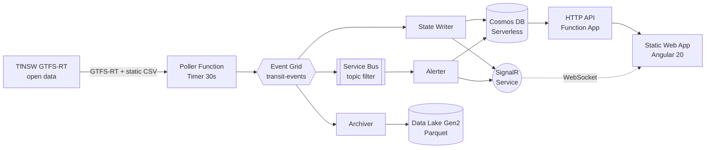

# Sydney Pulse

Real-time disruption intelligence for Sydney public transport.
Event-driven Azure architecture built on TfNSW open data.

**Live:** https://proud-grass-020b12300.7.azurestaticapps.net/ · [dashboard](https://proud-grass-020b12300.7.azurestaticapps.net/live) · [evidence walkthrough](https://proud-grass-020b12300.7.azurestaticapps.net/evidence)
**Status:** `v0.1.1` — Sprint 1 close + evidence page (2026-07-15). Next: [Sprint 2 →](docs/sprints/sprint-2.md)

---

## What it does

Sydney Pulse polls the TfNSW GTFS-Realtime feed every 30 seconds, fans
vehicle updates and service alerts out through Event Grid, persists
them into Cosmos DB (with a Data Lake archive for long-term analytics),
broadcasts live changes over SignalR, and renders them on an Angular
map that "pulses" every time a marker's position updates. The whole
pipeline is defined in Bicep, deployed by GitHub Actions on every push
to `main`, and secured with Managed Identity end-to-end — no secrets
in app settings.

Portfolio target: .NET Senior + Azure + CI/CD + Angular-familiar roles.
Built on top of six years of production experience with the same Azure
primitives (Service Bus + Functions + SignalR pipelines) on prior
projects.

## Architecture



Full component map with secrets & telemetry edges and per-file
references lives in [docs/diagrams.md](docs/diagrams.md). Reasoning
for each major choice lives in [docs/adr/](docs/adr/) (14 records).

## CI/CD pipeline

Every push to `main` triggers `deploy-dev`, a four-job pipeline on
GitHub Actions:

```
lint-test → deploy-infra → publish-app (Functions)
                        ↘ publish-web  (SWA)
```

- **`lint-test`** — `dotnet format --verify-no-changes`, 64 backend
  unit tests, `bicep build`
- **`deploy-infra`** — `az deployment group create` against
  `sydney-pulse-rg-dev`, idempotent
- **`publish-app`** and **`publish-web`** run in parallel after infra
  is green; total ~5 min wall time
- All jobs use OIDC federated identity — zero static secrets in
  GitHub. Node 24 runtimes across every action
- Reusable workflows in `.github/workflows/_*.yml`; same shape will
  drive the prod slot swap in Sprint 2

## Tech stack

| Layer | Choice | ADR |
|---|---|---|
| Backend | .NET 8 isolated-worker Azure Functions | — |
| Frontend | Angular 20 standalone, RxJS + Signals, Tailwind, raw Leaflet | [0005](docs/adr/0005-angular-over-react.md), [0014](docs/adr/0014-raw-leaflet-no-wrapper.md) |
| Infrastructure | Bicep (not Terraform) | [0004](docs/adr/0004-bicep-over-terraform.md) |
| CI/CD | GitHub Actions (not Azure Pipelines) | — |
| Hosting | Static Web Apps + Functions Consumption | — |
| Messaging | Event Grid + Service Bus topic subscription filter | [0001](docs/adr/0001-event-driven-with-eventgrid.md), [0003](docs/adr/0003-service-bus-tier-choice.md) |
| Data | Cosmos DB Serverless (partition by `routeShortName`), Data Lake Gen2 Parquet | [0002](docs/adr/0002-cosmos-serverless.md), [0011](docs/adr/0011-denormalized-vehicle-document.md), [0012](docs/adr/0012-archive-as-ml-feature-store.md) |
| Realtime | SignalR Service Free SKU (Serverless mode) | [0008](docs/adr/0008-signalr-free-sku.md) |

## Getting started locally

Prerequisites: .NET 8 SDK, Node 20+ (22 LTS recommended — Angular 20
requires ≥20.19 or ≥22.12), Azurite (Functions storage emulator),
Azure Functions Core Tools v4.

**Backend:**

```powershell
cd functions/SydneyPulse.Functions
dotnet clean SydneyPulse.Functions.csproj    # required to avoid the 2-csproj bug
func start                                   # http://localhost:7071
```

**Frontend:**

```powershell
cd web
npm ci
npm start                                    # http://localhost:4200
```

`web/src/environments/environment.ts` points at the deployed dev
backend, so `ng serve` works standalone without a local Functions host
if you don't need to iterate on Function code.

**Deploy to dev:** `gh workflow run deploy-dev.yml` — full runbook in
[docs/runbooks/deploy.md](docs/runbooks/deploy.md).

## Documentation

- **Evidence walkthrough** — [/evidence](https://proud-grass-020b12300.7.azurestaticapps.net/evidence) (live) · [docs/evidence.md](docs/evidence.md) (source)
- **Architecture** — [architecture.md](docs/architecture.md) · [diagrams.md](docs/diagrams.md)
- **API contracts** — [api.md](docs/api.md) (HTTP + SignalR)
- **Decisions** — [ADRs](docs/adr/) (14 records)
- **Runbooks** — [deploy](docs/runbooks/deploy.md) · [rollback](docs/runbooks/rollback.md) · [incident response](docs/runbooks/incident-response.md)
- **Cost model** — [cost-model.md](docs/cost-model.md)
- **Build / demo / offline modes** — [modes.md](docs/modes.md)
- **Sprint plans + progress** — [sprints/](docs/sprints/)
- **Project rules for Claude Code** — [CLAUDE.md](CLAUDE.md)

## Repository layout

```
/functions/   .NET solution — Functions host, Core library, xUnit tests
/web/         Angular standalone app + Leaflet map + Tailwind
/infra/       Bicep modules and per-environment parameter files
/docs/        Architecture reference, ADRs, runbooks, sprint plans
/.github/     Reusable workflows + deploy-dev pipeline
```

## Sprint roadmap

- **Sprint 1 (`v0.1.0` + `v0.1.1`)** — full event pipeline in dev, live public
  URL, SignalR-driven dashboard with pulse animation, in-app evidence
  walkthrough at `/evidence`. **Shipped.**
- **Sprint 2** — production slot swap, freshness-ring liveness
  indicator, `demo` mode (fixture-based Poller replay) for off-peak
  interviews.
- **Sprint 3–5** — analytics view, KQL anomaly detection,
  ONNX-in-Function prediction.

Sprint detail in [docs/sprints/](docs/sprints/); current state
authoritative in [docs/sprints/progress.md](docs/sprints/progress.md).
