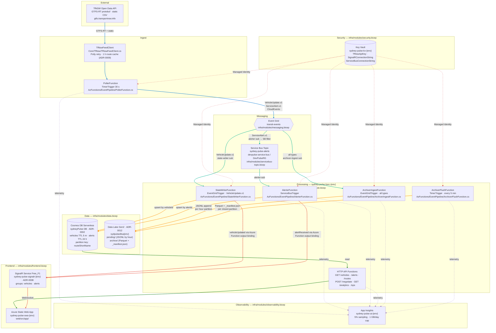

# Architecture diagrams

Visual companion to [architecture.md](architecture.md).
Update this file in the same PR whenever the Azure topology changes:
new function, new data store, new messaging route, renamed resource, or rewired data flow.

## Azure topology

Full component map from TfNSW ingest through to the Angular frontend.
Dashed arrows are cross-cutting concerns (secrets, telemetry).

### Edge colour legend

Solid lines = main data flows you follow to understand the application. Dashed lines = out-of-band concerns that are real but not part of the data story.

| Colour | Path |
|---|---|
| Blue `#0078D4` | **Ingest** — raw data from TfNSW through to Event Grid |
| Teal `#00B294` | **Event fan-out** — Event Grid routing to each subscriber |
| Amber `#FF8C00` | **Write** — durable state written to Cosmos or Data Lake |
| Red `#E74C3C` | **Real-time push** — live updates through SignalR to Angular |
| Green `#107C10` | **Read** — on-demand query from Cosmos through HTTP API |
| Red dashed `#D13438` | **Managed Identity** — Key Vault secrets pulled by functions at runtime |
| Purple dashed `#8764B8` | **Telemetry** — traces and metrics emitted to App Insights |

## Key file map

| Component | Primary file | Bicep module |
|---|---|---|
| TfNSW client + route cache | `functions/SydneyPulse.Core/TfNsw/TfNswFeedClient.cs` | — |
| Poller Function | `functions/SydneyPulse.Functions/AzFunctions/EventPipeline/PollerFunction.cs` | `compute.bicep` |
| State Writer Function | `functions/SydneyPulse.Functions/AzFunctions/EventPipeline/StateWriterFunction.cs` | `compute.bicep` |
| Alerter Function | `functions/SydneyPulse.Functions/AzFunctions/EventPipeline/AlerterFunction.cs` | `compute.bicep` |
| Archiver Ingest Function | `functions/SydneyPulse.Functions/AzFunctions/EventPipeline/ArchiverIngestFunction.cs` | `compute.bicep` |
| Archiver Flush Function | `functions/SydneyPulse.Functions/AzFunctions/EventPipeline/ArchiverFlushFunction.cs` | `compute.bicep` |
| Pending blob store (abstraction) | `functions/SydneyPulse.Functions/Archive/PendingBlobStore.cs` | — |
| Parquet writer | `functions/SydneyPulse.Core/Archive/ParquetArchiveWriter.cs` | — |
| Hive partition path helper | `functions/SydneyPulse.Core/Archive/HivePartitionPath.cs` | — |
| Archive manifest model | `functions/SydneyPulse.Core/Archive/ArchiveManifest.cs` | — |
| HTTP API Functions | `functions/SydneyPulse.Functions/AzFunctions/HttpApi/` | `compute.bicep` |
| Event Grid subscriptions | — | `messaging.bicep` |
| Service Bus topic | — | `servicebus-topic.bicep` |
| Cosmos DB containers | `functions/SydneyPulse.Core/Cosmos/` | `data.bicep` |
| Key Vault | — | `security.bicep` |
| SignalR Service | — | `frontend.bicep` |
| Static Web App | `web/src/app/` | `frontend.bicep` |
| App Insights + Log Analytics | — | `observability.bicep` |
| Role assignments (MI) | — | `role-assignments.bicep` |
