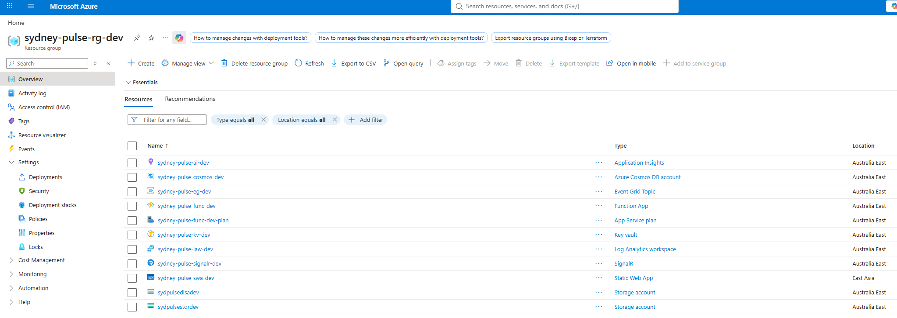
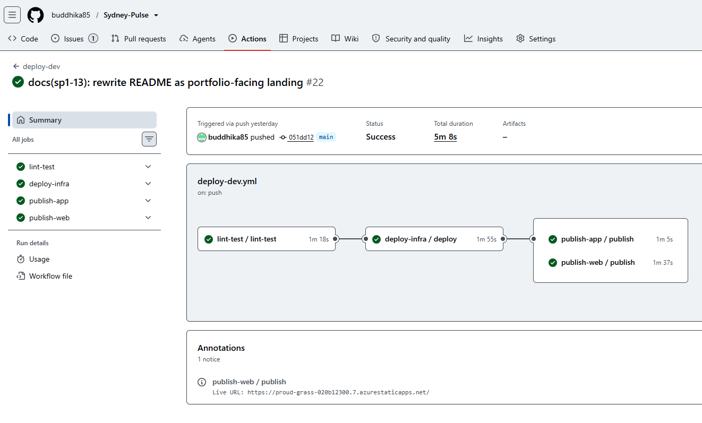
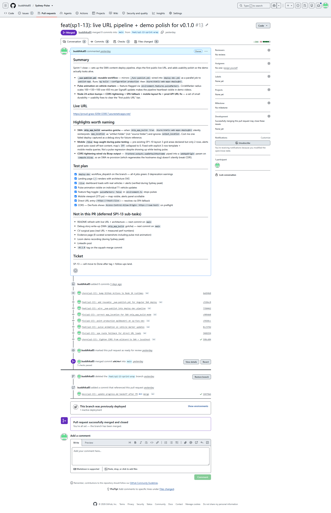
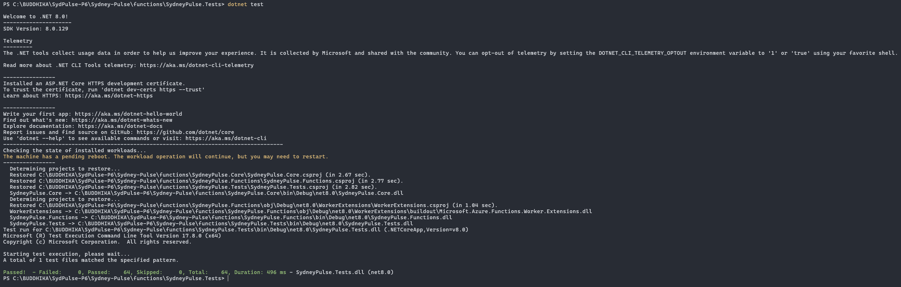
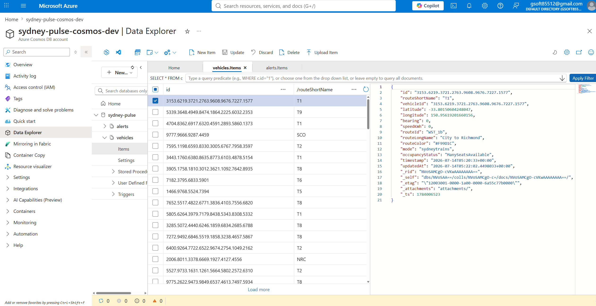
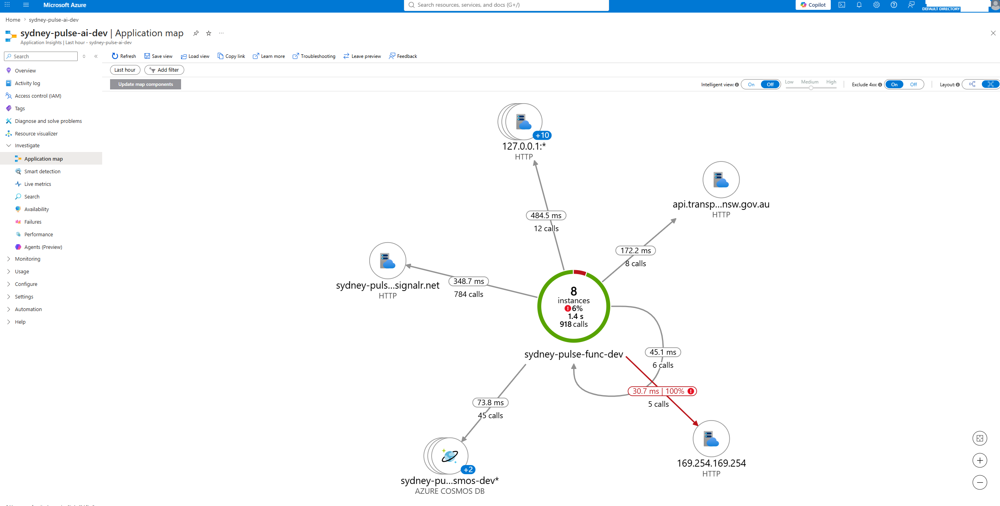
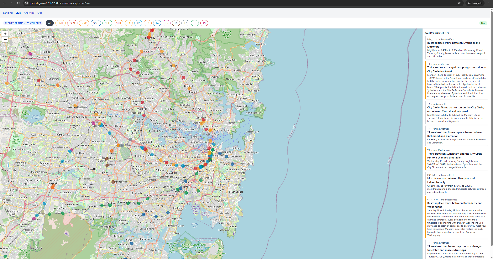
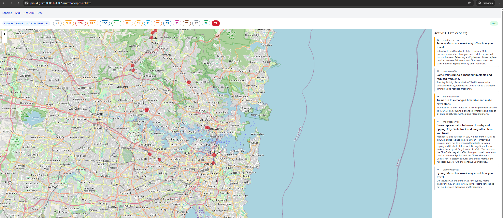
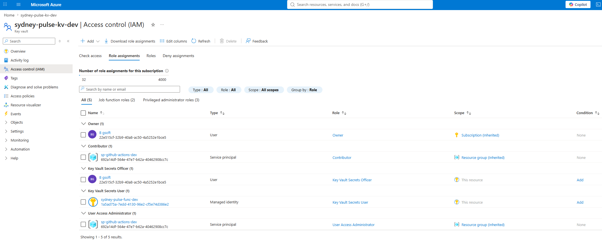

# Evidence — Sprint 1 shipped state

A curated 8-shot walk through Sydney Pulse's shipped state. Each shot
proves one specific claim; captions link the claim to what's in frame.
Screenshots are point-in-time from mid-July 2026; the underlying live
system may have evolved since.

For architecture reasoning, see [docs/architecture.md](architecture.md)
and the [ADRs](adr/). For the live system, see
https://proud-grass-020b12300.7.azurestaticapps.net/.

---

## 1. Azure resource group — full topology under Bicep control

Azure Portal → **Resource groups** → `sydney-pulse-rg-dev` → **Overview**.

All 11 top-level resources — Function App + hosting plan, Cosmos DB,
Static Web App, SignalR Service, Key Vault, App Insights, Log Analytics
workspace, Data Lake storage account, Event Grid topic, Functions
storage — declared in one Bicep entrypoint (`infra/main.bicep`). Zero
click-ops, zero portal-created resources hiding in the RG. Sub-resources
(Cosmos containers, Event Grid subscriptions, Key Vault secrets) live
below these and are also Bicep-managed.



## 2. GitHub Actions pipeline — 4 jobs green, deploy-dev

GitHub → Actions → `deploy-dev` → most recent successful run.

The full pipeline in one image: `lint-test` → `deploy-infra` →
`publish-app` + `publish-web` (parallel). All green, Node 24
runtimes, OIDC federated identity, ~5 min total wall time. No static
secrets pass through GitHub.



## 3. Merged PR #13 — Sprint 1 close via squash-merge

GitHub → Pull requests → Closed → **#13** ("feat(sp1-13): live URL
pipeline + demo polish for v0.1.0").

Squash-merge preserves a clean linear main history; the 8 branch commits
collapse into one release-shaped commit on `main`. Feature branches
deleted after merge (both local + remote).



## 4. Backend unit tests — 64/64 passing

Terminal, from repo root:

```powershell
dotnet test functions/SydneyPulse.sln --verbosity normal
```

xUnit across `TfNswFeedClient`, State Writer, Alerter, Archiver, HTTP
API surface, Cosmos repositories, Event Grid schemas. Frontend unit
tests deferred to [SP-21](https://gsoft85512.atlassian.net/browse/SP-21)
by explicit sprint scoping.



## 5. Cosmos DB Data Explorer — live vehicles partitioned correctly

Azure Portal → `sydney-pulse-cosmos-dev` → **Data Explorer** →
`sydneyPulse` → `vehicles` container → **Items**.

Real vehicle documents streamed from TfNSW via the full pipeline.
Partition key is `routeShortName` (T1, T2, T4, T8, ...) per
[ADR-0002](adr/0002-cosmos-serverless.md) and
[ADR-0011](adr/0011-denormalized-vehicle-document.md), matching how
the UI groups vehicles.



## 6. App Insights end-to-end transaction

Azure Portal → `sydney-pulse-ai-dev` → **Investigate** →
**Application map** (or **Transaction search** → drill into one Poller
invocation).

One TfNSW poll traced end-to-end: Poller function invocation → Event
Grid publish → State Writer subscription → Cosmos upsert → SignalR
broadcast. Each hop is a separate telemetry entry linked by
`operation_Id`. Sampling fixed at 5% with a 1 GB/day cap
([CLAUDE.md](../CLAUDE.md) constraint).



## 7. Live dashboard — real vehicles, real alerts, live

Browser at https://proud-grass-020b12300.7.azurestaticapps.net/live
during Sydney peak. Two frames — full network + filtered view — to
show both the pipeline's breadth and the interaction surface.

### 7a. Full network view

34+ CircleMarkers coloured by route across the Sydney rail network
(T1–T9 + BMT, CCN, NRC, SCO, SHL), all streamed from TfNSW GTFS-RT
through the pipeline. Alerts panel populated with 75 active alerts.
Freshness pill "Live" (green) top-right. Pulse animation on each
SignalR update — visible as a brief scale-up of individual markers
against the dense background.



### 7b. Filtered view — single route + interaction proof

Same dashboard with a route chip active — filter reduces the map to
one line's vehicles. Proves the interactive surface (filter chips,
route grouping, dashboard state) is wired through Signals + RxJS
without breaking the SignalR stream.



## 8. Key Vault RBAC — Managed Identity, zero static secrets

Azure Portal → `sydney-pulse-kv-dev` → **Access control (IAM)** →
**Role assignments**.

Function App's system-assigned Managed Identity holds
`Key Vault Secrets User`; no other principals except the deploying
user for seed operations. Every secret access from the Function App
goes through MI + RBAC — no connection strings in app settings, no
service principal credentials stored anywhere. Same pattern extends
to Cosmos DB, Event Grid, Service Bus, and Data Lake per
`infra/modules/security.bicep`.



---

## Capture cheatsheet

Rough order to capture in one sitting to minimise context-switching:

**Batch A — Azure Portal (all in one browser tab, ~30 min)**
1, 5, 6, 8 — resource group, Cosmos Data Explorer, App Insights,
Key Vault RBAC.

**Batch B — GitHub UI (~15 min)**
2, 3 — deploy-dev run, PR #13.

**Batch C — Local + browser (~20 min)**
4 — terminal `dotnet test` output.
7 — live dashboard during Sydney peak (schedule for 8-9am or
5-6pm AEST for dense traffic + visible pulses).

Total ~65 min end-to-end. Under the 90-min guardrail.

## Filename convention

`docs/images/evidence-NN-<slug>.png` (matches the placeholder paths
above). NOT gitignored — these are portfolio evidence, meant to be
tracked and rendered on GitHub. The debug-story images at
`docs/images/*-story-*.png` are gitignored under a different rule.
