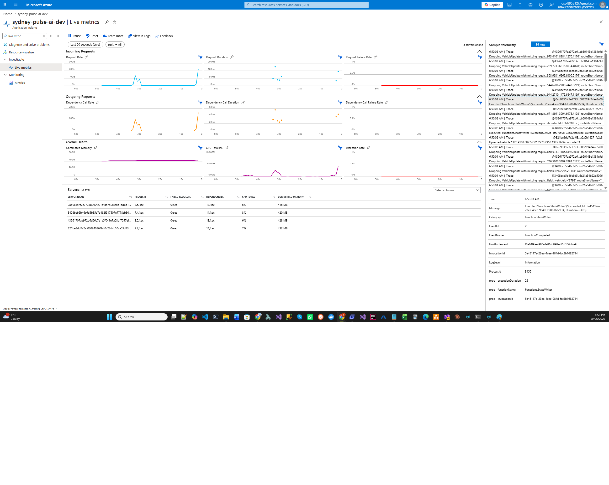
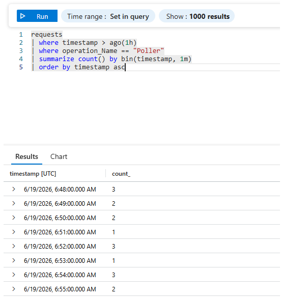
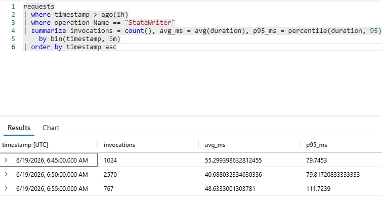
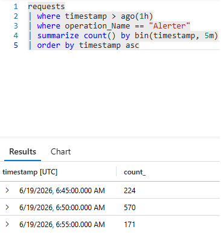
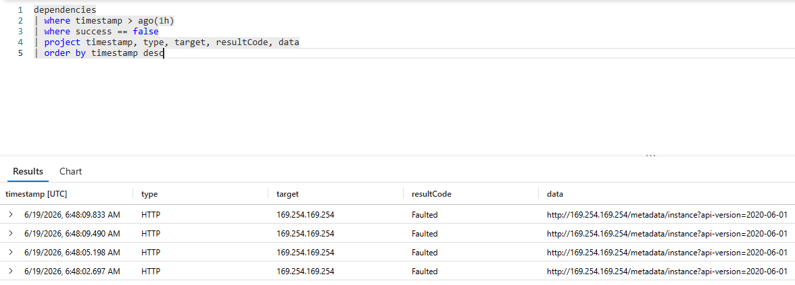
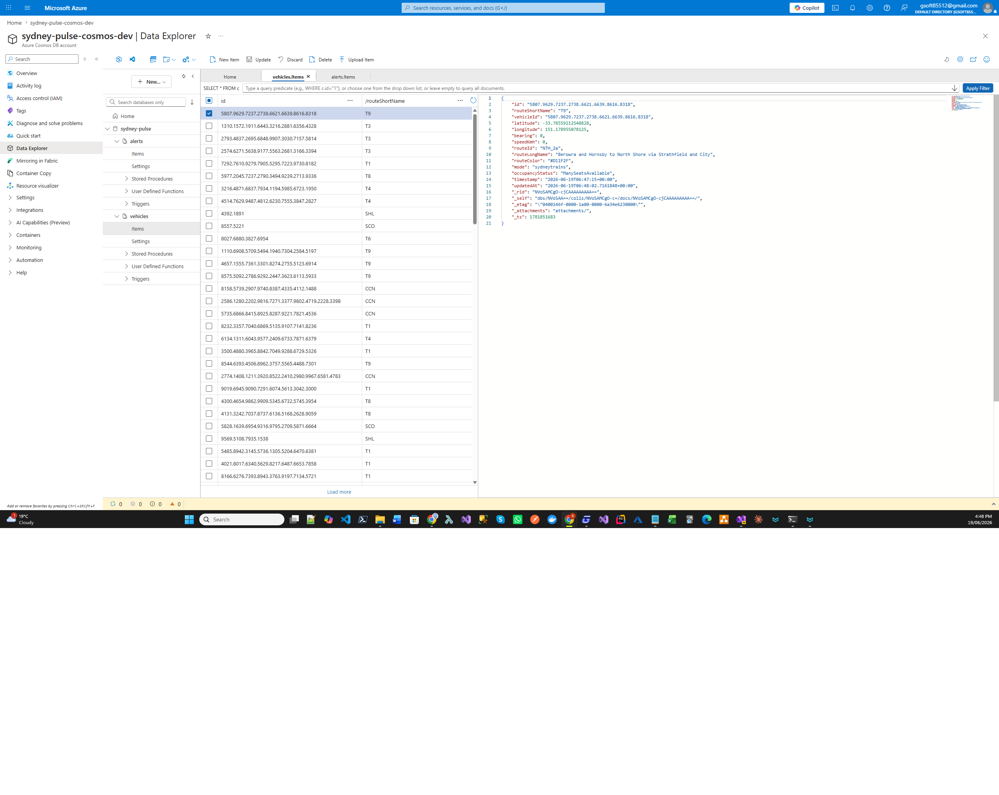
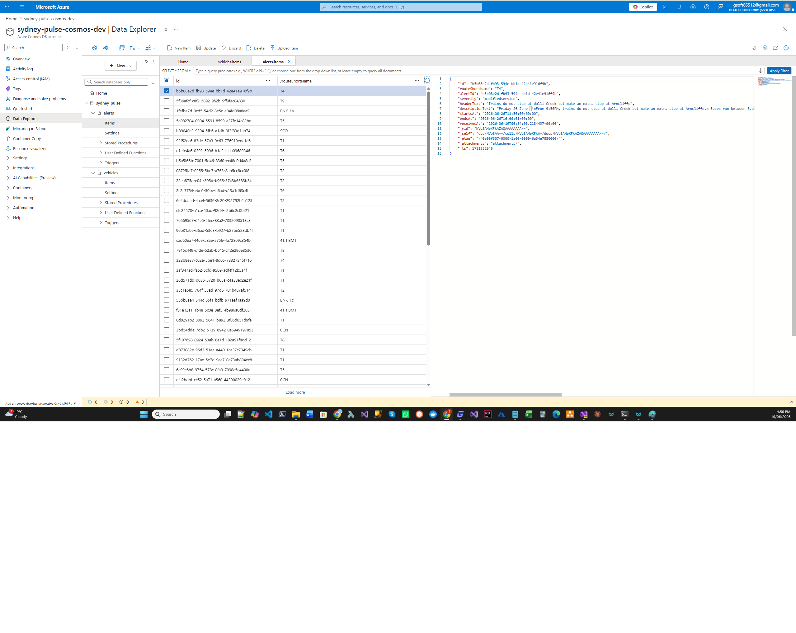
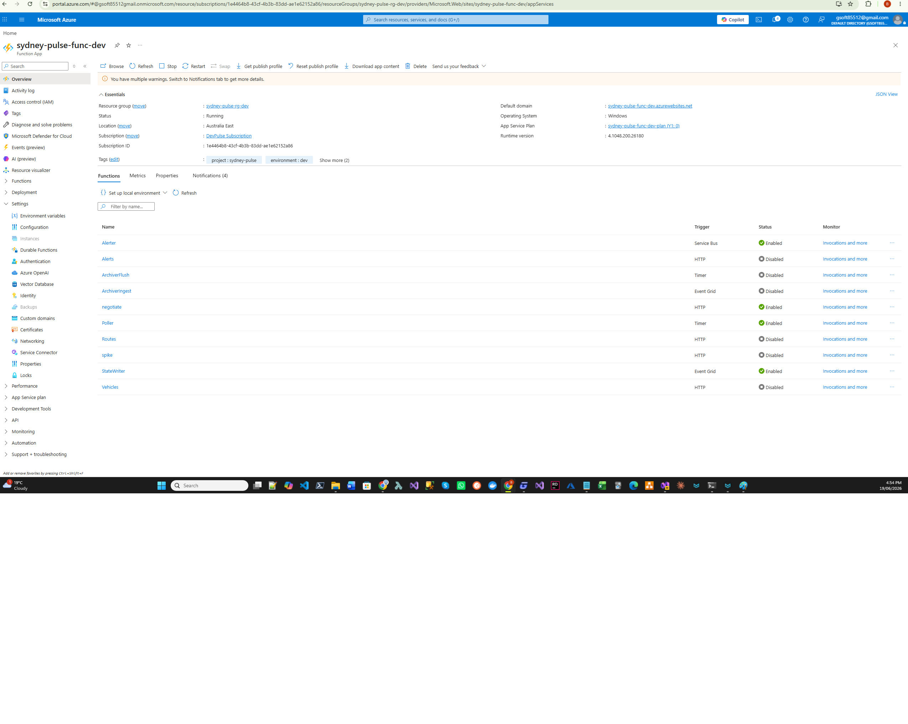
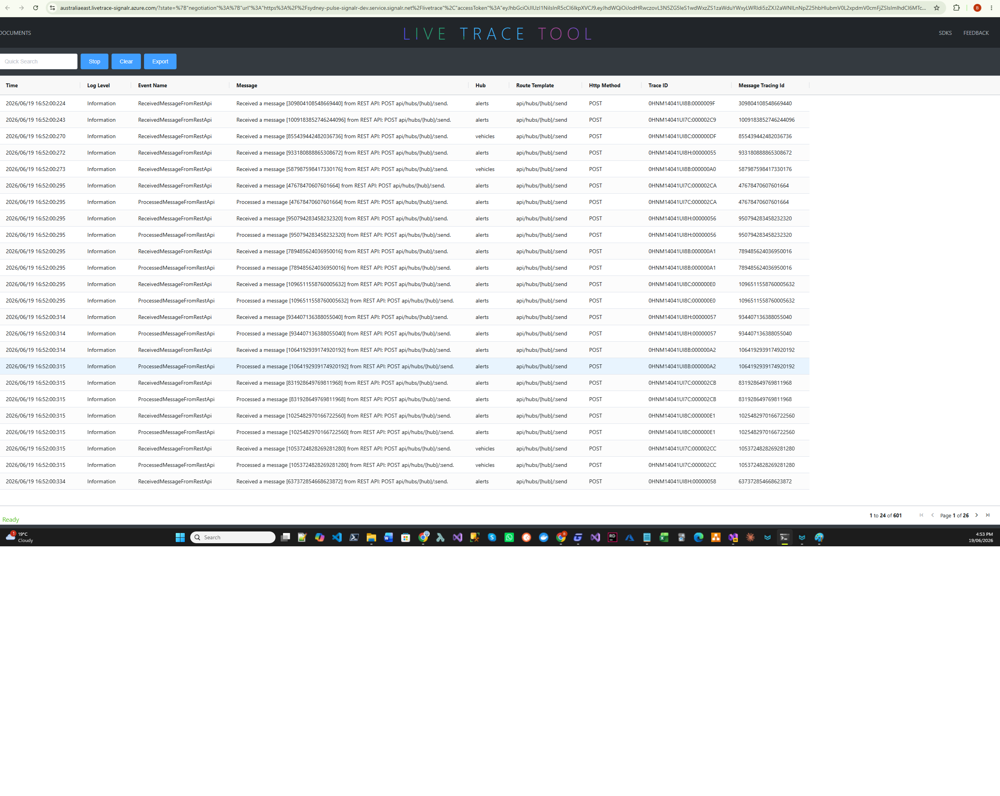
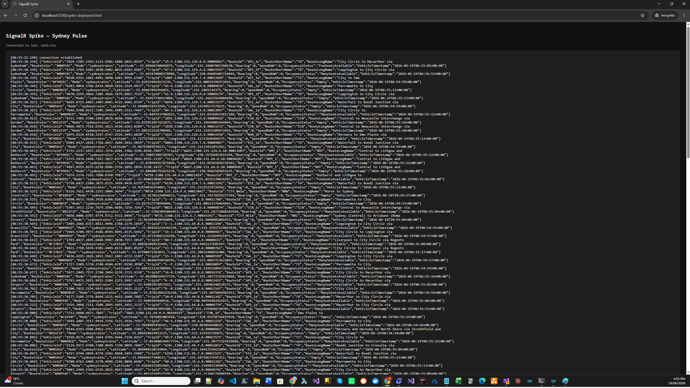

# Runbook: dev smoke evidence

Evidence pack for SP1-16 — proves the full SydneyPulse backend ran end-to-end
in real Azure (dev environment). Captures one full smoke run of the
Poller → Event Grid → StateWriter / Alerter → Cosmos → SignalR pipeline,
the HTTP API, and the spike client.

Out of scope: Archiver (D.5 / D.6 descoped to SP-19). Front-end smoke
(SP1-09 / SP1-10).

Screenshots live under `images/dev-smoke-evidence/`. Captured JSON
fixtures live alongside the unit-test fixtures in
`functions/SydneyPulse.Tests/Fixtures/` so they can also be replayed by
tests if useful.

---

## 1. Test window

| Field | Value |
|---|---|
| Date(s) | 2026-06-17 PM (AEST) |
| Function App | `sydney-pulse-func-dev` (Consumption Y1, Windows, .NET 8 isolated) |
| Cosmos account | `sydney-pulse-cosmos-dev` (Serverless, `australiaeast`) |
| Event Grid topic | `sydney-pulse-eg-dev` |
| SignalR | `sydney-pulse-signalr-dev` (Free F1, Serverless mode) |
| Service Bus | `devpulse-service-bus` / topic `sydney-pulse-alerts` |
| Smoke client | `spike-deployed.html` (repo root) |
| Build/commit | `6f84c16` (SignalR group-vs-hub fix already in place) |

Smoke ran for ~10 min after redeploy. Cosmos RU budget kept the run
short (per CLAUDE.md "Cosmos RU budget: smoke test should run for ≤30 min").

---

## 2. App Insights — Live Metrics

What this shows: real-time request rate during the smoke window, with
Poller firing every 30 s and StateWriter / Alerter responding to each tick.

How to capture:
- Portal → `sydney-pulse-ai-dev` → Live Metrics
- Wait until Poller invocations are visible in the request graph
- Screenshot full pane



---

## 3. App Insights — KQL traces

Run each query in the App Insights Logs blade. Adjust the time range to
the smoke window. Screenshot the result panel for each.

### 3.1 Poller firing on its 30-second cadence

```kql
requests
| where timestamp > ago(1h)
| where operation_Name == "Poller"
| summarize count() by bin(timestamp, 1m)
| order by timestamp asc
```

Expected: ~2 invocations per minute, flat line.



### 3.2 StateWriter Event Grid invocations + durations

```kql
requests
| where timestamp > ago(1h)
| where operation_Name == "StateWriter"
| summarize invocations = count(), avg_ms = avg(duration), p95_ms = percentile(duration, 95)
    by bin(timestamp, 5m)
| order by timestamp asc
```

Expected: invocations track Poller cadence × vehicle-mode count; avg
duration well under the Function timeout.



### 3.3 Alerter Service Bus invocations

```kql
requests
| where timestamp > ago(1h)
| where operation_Name == "Alerter"
| summarize count() by bin(timestamp, 5m)
| order by timestamp asc
```

Sparser than StateWriter overall, but rate varies with real TfNSW alert volume (the smoke window above caught a busy period — ~570 alerts in one 5-min bin coincides with active route disruptions).



### 3.4 Failed dependencies in the smoke window (sanity check)

```kql
dependencies
| where timestamp > ago(1h)
| where success == false
| project timestamp, type, target, resultCode, data
| order by timestamp desc
```

Expected: empty, OR a handful of transient IMDS failures (target
`169.254.169.254` — Azure Instance Metadata Service used by Managed
Identity for token refresh). These are normal platform behaviour and
harmless — the underlying call succeeds via the SDK's retry. Anything
else (TfNSW 5xx not retried, Cosmos throttling, SignalR 500s) would be
a real signal.



---

## 4. Cosmos Data Explorer

What this shows: live data sitting in the dev Cosmos account after the
smoke run — proof that StateWriter / Alerter committed documents.

How to capture:
- Portal → `sydney-pulse-cosmos-dev` → Data Explorer → `sydneyPulse` DB

### 4.1 `vehicles` container

Open `vehicles` → Items. Sort/scroll until you see a populated set.
Screenshot showing 20+ documents with diverse `routeShortName` values.



### 4.2 `alerts` container

Open `alerts` → Items. Screenshot showing at least a handful of alert
documents from the smoke window.



---

## 5. Function App → Functions blade

What this shows: each Function class, its trigger type, and invocation
count over the smoke window.

How to capture:
- Portal → `sydney-pulse-func-dev` → Functions
- Screenshot the Functions table — all discovered functions with
  Trigger type and Enabled status. The Archiver functions
  (`ArchiverIngest`, `ArchiverFlush`) appear in the list but are
  unwired in dev — EG subscription deferred to SP-19. Per-function
  invocation history is one click away under the "Invocations and
  more" link in the Monitor column.



---

## 6. ★ SignalR Live Trace Tool

**Featured.** This is the tool that broke the D.8 impasse — see Debug
Story #20 in `docs/sp1-16-debug-stories.md` and interview-prep Q2 under
SP1-16. Without Live Trace we would still be guessing whether the bug
was in the Function output binding, the SignalR service, or the browser.

How to capture:
- Portal → `sydney-pulse-signalr-dev` → Diagnostics → Live Trace Tool
- Click "Open Live Trace Tool" — opens a separate page that captures
  every event at the service boundary in real time
- Trigger smoke (Poller tick + an alert if one fires), let it run ~30 s
- Screenshot the trace panel showing messages on **both** the `vehicles`
  and `alerts` hubs



Interpretation: each row is one event at the service boundary —
`Connection`, `MessageOnHub`, `MessageReceived`. After the group-vs-hub
fix, `MessageOnHub` rows now fan out to every connected client on the
hub instead of being filtered to a 0-member group.

---

## 7. HTTP API — curl outputs

Function App requires a function-level auth key for HTTP-triggered
endpoints. Get it from Portal → `sydney-pulse-func-dev` → Functions →
`<FunctionName>` → Function Keys. Substitute `<FUNC_KEY>` below.

### 7.1 `/api/vehicles`

```bash
curl "https://sydney-pulse-func-dev.azurewebsites.net/api/vehicles?mode=trains&code=<FUNC_KEY>"
```

Captured response: `functions/SydneyPulse.Tests/Fixtures/vehicles-T1-2026-06-17.json`

### 7.2 `/api/alerts`

```bash
curl "https://sydney-pulse-func-dev.azurewebsites.net/api/alerts?code=<FUNC_KEY>"
```

Captured response: `functions/SydneyPulse.Tests/Fixtures/alerts-2026-06-17.json`

### 7.3 `/api/routes`

```bash
curl "https://sydney-pulse-func-dev.azurewebsites.net/api/routes?code=<FUNC_KEY>"
```

Captured response: `functions/SydneyPulse.Tests/Fixtures/routes-2026-06-17.json`

Each captured fixture is the actual JSON returned by the deployed
Function App on 2026-06-17 — re-usable as a contract reference for SP1-09
(Angular models) and SP-18 (Poller diff fixtures).

---

## 8. `spike-deployed.html` — mid-broadcast

What this shows: the spike client connected to the deployed SignalR
service via the deployed Function App's negotiate endpoint, receiving
real `vehicleUpdated` payloads.

How to capture:
- Serve `spike-deployed.html` locally (`python -m http.server 5500` from
  repo root, browse to `http://localhost:5500/spike-deployed.html`)
- Wait for the next Poller tick (≤30 s)
- Screenshot the log panel showing 10+ payloads with diverse
  `routeShortName` values (T1, T2, T3, T8, WST were seen on 2026-06-17)



---

## 9. Out of scope

| Surface | Why deferred | Tracked in |
|---|---|---|
| Archiver Ingest (D.5) | Sprint 1 frontend is Commuter-only — no consumer of archive data yet | SP-19 (Sprint 2) |
| Archiver Flush (D.6) | Same as above | SP-19 (Sprint 2) |
| Frontend smoke | Angular app not yet built | SP1-09 / SP1-10 |
| Prod environment | No prod RG until SP2-03 | Sprint 2 |

---

## Cross-references

- Sprint plan: `docs/sprints/backend-manual-deploy-plan.md` (Phase E)
- Debug stories from this smoke: `docs/sp1-16-debug-stories.md`
  (gitignored — stories #11–#15, #20)
- Story #20 interview prep: `docs/interview-prep.md` SP1-16 Q2
  (gitignored)
- ADR-0008 (SignalR Free SKU constraints)
- ADR-0011 (denormalized vehicle document — visible in the captured
  `vehicles-T1` fixture)
